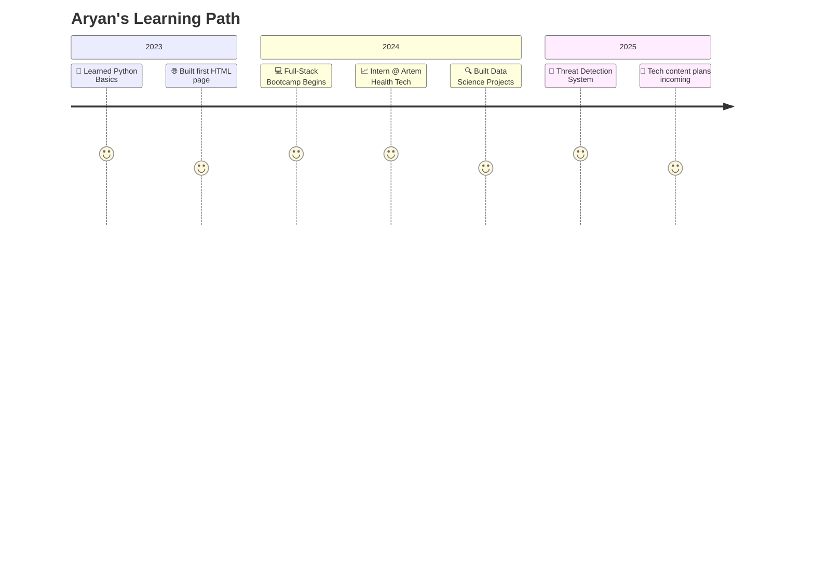

  
  <h1>Hey, I'm Aryan 👋</h1>
  <h3>AI Enthusiast • Full-Stack Web Dev • Tech Lover • Tea Addict 🍵</h3>
  

---

  

## 🧰 Tech Stack Breakdown

### 💻 Languages:

### 🌐 Frontend:

### 🧠 AI / ML:

### ⚙️ Tools & Platforms:

---

## 🚀 Featured Projects

| Project | Tech | Description |
|--------|------|-------------|
| 🔫 **Threat Detection YOLO v11** | Python, Deep Learning, OpenCV | Real-time object detection to identify threats via CCTV. |
| 💼 [**Portfolio Website**](https://aryan-dani.github.io/Portfolio) | HTML, CSS, JS | Interactive site showcasing my work and journey. |
| 📊 **Expense Tracker** | Google Forms, Make.com | Automated personal expense tracker using Google Forms and Sheets. |
| 🧬 **Threat Detection System** | CNN, YOLOv11 | Final year major project on real-time human detection. |

---

## 🧪 Certifications

- 📜 IBM Data Science Professional Certificate
- 🧠 Full-Stack Web Dev by Colt Steele
- 🛠️ Angular Course by Maximilian Schwarzmüller
- 📊 Data Visualization, Python for Everybody

---

## 📅 Journey So Far

---

## 💡 What I'm Up To

- 🔥 Currently building real-time threat detection using YOLOv11 and EfficientNetv2.
- 🧠 Learning deep learning and getting comfy with PyTorch & TensorFlow.
- 📈 Leveling up my full-stack dev game with Angular and React.
- 💬 Planning to start tech content—YouTube/Instagram incoming soon!

---

## 📫 Let's Connect

  
  
  
  
  
  

## ✨ Fun Facts About Me

- 🧋 Addicted to tea, not coffee (don’t @ me 😤).
- 🤖 Could talk about AI, tech, and gadgets for hours.
- 📱 I love smartphones more than most people love pizza (and that’s saying something).
- 💻 Coding with lo-fi and chai = perfect combo.

---

  
    
  
    
  

---
<!-- Snake Animation -->

<picture>
  <source media="(prefers-color-scheme: dark)" srcset="https://raw.githubusercontent.com/aryan-dani/aryan-dani/output/github-snake-dark.svg" />
  <source media="(prefers-color-scheme: light)" srcset="https://raw.githubusercontent.com/aryan-dani/aryan-dani/output/github-snake.svg" />
  
</picture>

  <h3>Thanks for stopping by ✨</h3>
  
   
  <em>Let's build cool things together! 🚀</em>

