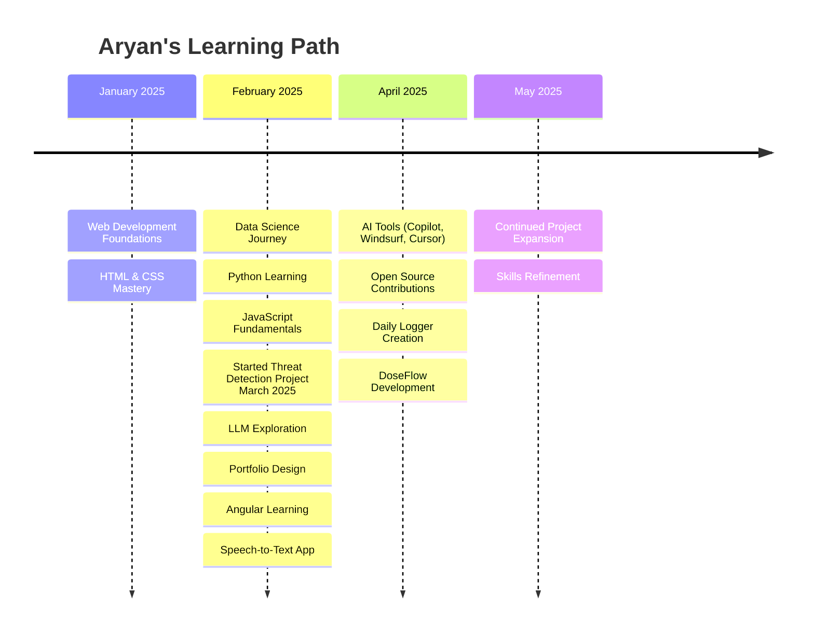

<!-- @format -->

<kbd style="display: block; width: 100%;">

  

  

  
</kbd>
  
<kbd style="display: block; width: 100%;">
  

    
    
  

</kbd>
  
   
<kbd>
  <!-- GitHub trophies -->
  

  

</kbd>

## 🛠️ Tech Stack Breakdown

<h3>💻 Languages</h3>

  
  
  
  
  
  
  
  

<ul>
  <li><b>Python:</b> Versatile language for web dev, data science, AI/ML.</li>
  <li><b>C++:</b> High-performance language for systems programming, game dev.</li>
  <li><b>JavaScript:</b> Core language for web interactivity and front-end development.</li>
  <li><b>TypeScript:</b> Superset of JavaScript adding static types for large-scale applications.</li>
  <li><b>Java:</b> Widely-used for enterprise-scale applications, Android app development.</li>
  <li><b>C#:</b> Developed by Microsoft, used for Windows apps, game development with Unity.</li>
  <li><b>Go:</b> Developed by Google, known for simplicity and efficiency in concurrent programming.</li>
  <li><b>PHP:</b> Server-side scripting language popular for web development, powers WordPress.</li>
</ul>

<h3>🌐 Web Development</h3>

  
  
  
  
  

<ul>
  <li><b>HTML5:</b> Standard markup language for creating web pages.</li>
  <li><b>CSS3:</b> Stylesheet language for designing web page appearance.</li>
  <li><b>Angular:</b> Comprehensive framework for building dynamic web applications.</li>
  <li><b>React:</b> Library for building user interfaces, particularly single-page applications.</li>
  <li><b>Bootstrap:</b> Front-end framework for responsive, mobile-first web design.</li>
</ul>

<h3>🧠 AI / ML</h3>

  
  
  
  
  

<ul>
  <li><b>TensorFlow:</b> Open-source library for machine learning and AI.</li>
  <li><b>PyTorch:</b> Open-source machine learning framework based on Torch library.</li>
  <li><b>Keras:</b> High-level neural networks API, running on top of TensorFlow, Theano, or CNTK.</li>
  <li><b>Pandas:</b> Data manipulation and analysis library for Python.</li>
  <li><b>OpenCV:</b> Library for real-time computer vision applications.</li>
</ul>

<h3>⚙️ Tools & Platforms</h3>

  
  
  
  

<ul>
  <li><b>Git:</b> Distributed version control system for tracking changes in source code.</li>
  <li><b>VS Code:</b> Popular, free source-code editor developed by Microsoft.</li>
  <li><b>Google Cloud:</b> Suite of cloud computing services offered by Google.</li>
  <li><b>AWS:</b> Comprehensive cloud computing platform by Amazon.</li>
</ul>

<h3>🗄️ Databases</h3>

  
  
  

<ul>
  <li><b>MongoDB:</b> NoSQL document database known for flexibility and scalability.</li>
  <li><b>SQLite:</b> Self-contained, serverless, transactional SQL database engine.</li>
  <li><b>Firebase:</b> Platform developed by Google for creating mobile and web applications.</li>
</ul>

---

## 🚀 Featured Projects

  

    <table width="100%">
      <thead>
        <tr>
          <th width="220px" align="center" style="border-bottom: 1px solid #333333;">
            Project
          </th>
          <th width="250px" align="center" style="border-bottom: 1px solid #333333;">
            Tech
          </th>
          <th width="300px" align="center" style="border-bottom: 1px solid #333333;">
            Description
          </th>
        </tr>
      </thead>
      <tbody>
        <tr>
          <td align="center">
            
          </td>
          <td>Python, Deep Learning, OpenCV, YOLO</td>
          <td>Real-time object detection system identifying threats via CCTV footage. Aiming for high accuracy in spotting suspicious activities.</td>
        </tr>
        <tr>
          <td align="center">
            
          </td>
          <td>HTML, CSS, JS</td>
          <td>A responsive, interactive site showcasing my projects and skills. Features smooth animations and a modern design.</td>
        </tr>
        <tr>
          <td align="center">
            
          </td>
          <td>Python, Tkinter</td>
          <td>A desktop application for logging daily activities and tasks.</td>
        </tr>
        <tr>
          <td align="center">
            
          </td>
          <td>Python, SpeechRecognition</td>
          <td>Converts speech into text using various speech recognition engines.</td>
        </tr>
        <tr>
          <td align="center">
            
          </td>
          <td>Python, Flask, SQLite</td>
          <td>A Health Management Information System for managing patient data.</td>
        </tr>
        <tr>
          <td align="center">
            
          </td>
          <td>Python, FastAPI, MongoDB</td>
          <td>API for managing medication schedules and adherence.</td>
        </tr>
        <tr>
          <td align="center">
            
          </td>
          <td>Python, Pydicom, OpenCV</td>
          <td>Tool for analyzing and visualizing DICOM medical images.</td>
        </tr>
        <tr>
          <td align="center">
            
          </td>
          <td>Python, Pandas, Scikit-learn</td>
          <td>Capstone project for a data science program, showcasing various DS skills.</td>
        </tr>
         <tr>
          <td align="center">
            
          </td>
          <td>Python, Pandas, Matplotlib</td>
          <td>Analysis of football match data to derive insights.</td>
        </tr>
        <tr>
          <td align="center">
            
          </td>
          <td>Python, FastAPI/Flask</td>
          <td>Demonstration of creating and interacting with APIs.</td>
        </tr>
      </tbody>
    </table>
  

---

## 🧪 Certifications

  

    <table width="90%" align="center" style="border: none;">
      <tr>
        <td width="48%" align="right" valign="middle">
          
        </td>
        <td width="52%" align="left" valign="middle">Mastered data analysis, visualization, and machine learning with Python.</td>
      </tr>
      <tr><td colspan="2" height="15"></td></tr>
      <tr>
        <td width="48%" align="right" valign="middle">
          
        </td>
        <td width="52%" align="left" valign="middle">Built MERN stack applications from scratch.</td>
      </tr>
      <tr><td colspan="2" height="15"></td></tr>
      <tr>
        <td width="48%" align="right" valign="middle">
          
        </td>
        <td width="52%" align="left" valign="middle">Developed scalable SPAs with Angular.</td>
      </tr>
      <tr><td colspan="2" height="15"></td></tr>
      <tr>
        <td width="48%" align="right" valign="middle">
          
        </td>
        <td width="52%" align="left" valign="middle">Enhanced skills in data storytelling and Python programming.</td>
      </tr>
    </table>
  

---

## 📅 My Tech Journey

  

    <h3>Timeline</h3>
    <table width="90%" align="center" style="border: none;">
      <tr>
        <td align="right" width="180px" valign="top"><b>January 2025 🌐</b></td>
        <td>Started web development journey, mastered HTML and CSS fundamentals.</td>
      </tr>
      <tr><td colspan="2" height="10"></td></tr>
      <tr>
        <td align="right" width="180px" valign="top"><b>February 2025 📊</b></td>
        <td>Began JavaScript learning, initiated Threat Detection and Expense Tracker projects, started Python and data science, completed IBM Professional Data Science certification and Google Cloud Skill Boost courses.</td>
      </tr>
      <tr><td colspan="2" height="10"></td></tr>
      <tr>
        <td align="right" width="180px" valign="top"><b>March 2025 🧠</b></td>
        <td>Designed portfolio website, explored large language models, learned Angular framework and built Speech-to-Text application.</td>
      </tr>
      <tr><td colspan="2" height="10"></td></tr>
      <tr>
        <td align="right" width="180px" valign="top"><b>April 2025 🤖</b></td>
        <td>Explored AI coding tools (GitHub Copilot, Windsurf, Cursor), made open source contributions, developed Daily Logger application and DoseFlow project.</td>
      </tr>
      <tr><td colspan="2" height="10"></td></tr>
      <tr>
        <td align="right" width="180px" valign="top"><b>May 2025 🚀</b></td>
        <td>Currently expanding project portfolio and refining skills across multiple domains.</td>
      </tr>
    </table>
  

---

## 📫 Let's Connect

  

    
I'm always looking to collaborate on exciting projects or just chat about tech! Reach out through any of these platforms:

  

      
      
      
      
    

  

---

## ✨ Fun Facts About Me

  

    <table width="90%" align="center">
      <tr>
        <td width="5%" align="right"></td>
        <td width="50%" align="left">Addicted to tea, not coffee (don't @ me 😤).</td>
      </tr>
      <tr><td colspan="2" height="10"></td></tr>
      <tr>
        <td width="5%" align="right"></td>
        <td width="50%" align="left">Could talk about AI, tech, and gadgets for hours.</td>
      </tr>
      <tr><td colspan="2" height="10"></td></tr>
      <tr>
        <td width="5%" align="right"></td>
        <td width="50%" align="left">I love smartphones more than most people love pizza (and that's saying something).</td>
      </tr>
      <tr><td colspan="2" height="10"></td></tr>
      <tr>
        <td width="5%" align="right"></td>
        <td width="50%" align="left">Coding with lo-fi and chai = perfect combo.</td>
      </tr>
    </table>
  

---

## 📊 GitHub Stats

  

  <!-- GitHub Streak Stats - Monochrome -->
  

  

  <!-- Smaller width stats cards with flex layout -->
  
  &nbsp;&nbsp;
  

  

  <!-- Activity Graph -->
  
  

---

  <!-- Snake Animation - Monochrome style -->
  <picture>
    <source media="(prefers-color-scheme: dark)" srcset="https://raw.githubusercontent.com/aryan-dani/aryan-dani/output/github-snake-dark.svg" />
    <source media="(prefers-color-scheme: light)" srcset="https://raw.githubusercontent.com/aryan-dani/aryan-dani/output/github-snake.svg" />
    
  </picture>

  

    
  

