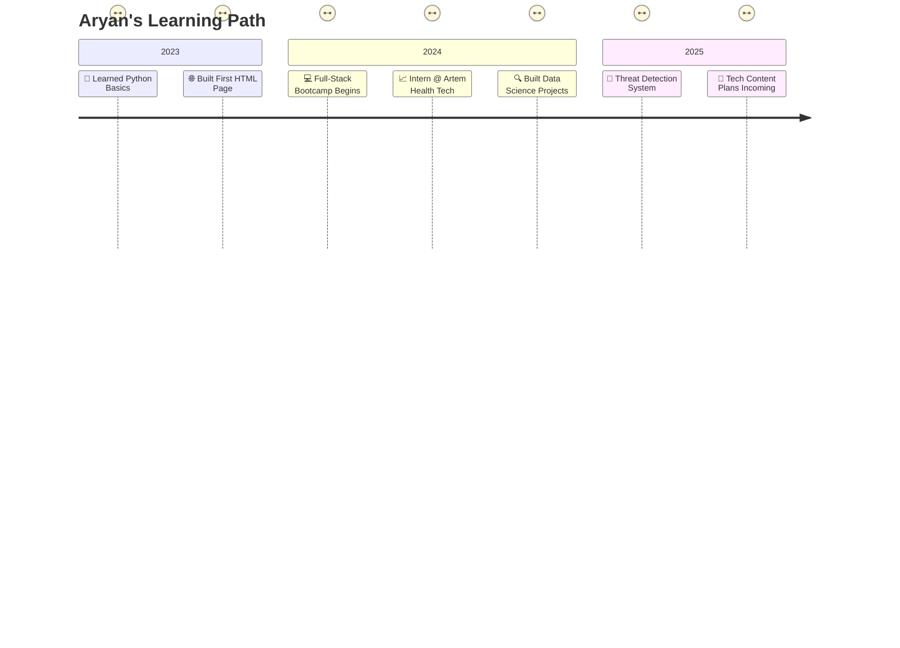

  
  <h1>Hey, I'm Aryan 👋</h1>
  <h3>AI Enthusiast • Full-Stack Web Dev • Tech Lover • Tea Addict 🍵</h3>
  

---

  

  

---

## 🧰 Tech Stack Breakdown

### 💻 Languages
- **C/C++**: For systems programming and performance-critical applications.  
- **Python**: Data science, AI/ML, scripting, and automation.  
- **JavaScript/TypeScript**: Building interactive, scalable web applications.

### 🌐 Frontend
- **HTML5, CSS3, SASS**: Crafting responsive, visually appealing interfaces.  
- **Bootstrap**: Rapid prototyping and responsive design.  
- **Angular & React**: Dynamic single-page applications (SPAs) with modern frameworks.

### 🧠 AI / ML
- **TensorFlow (with Keras)**: Deep learning for image and text processing.  
- **PyTorch**: Experimenting with neural networks and real-time AI solutions.  
- **OpenCV**: Computer vision for real-time object detection.

### ⚙️ Tools & Platforms
- **VS Code**: Primary editor with productivity-boosting extensions.  
- **Git & GitHub**: Version control and collaborative development.  
- **Google Cloud Platform (GCP)**: Cloud services for AI and data processing.  
- **AWS**: Scalable cloud infrastructure for applications.

---

## 🚀 Featured Projects

| Project | Tech | Description |
|--------|------|-------------|
| 🔫 [**Threat Detection YOLO v11**](https://github.com/aryan-dani/threat-detection-yolo) | Python, Deep Learning, OpenCV, YOLOv11 | Real-time object detection system identifying threats via CCTV footage. Achieved 85% accuracy in spotting suspicious activities. |
| 💼 [**Portfolio Website**](https://aryan-dani.github.io/Portfolio) | HTML, CSS, JS, Angular | A responsive, interactive site showcasing my projects and skills. Features smooth animations and a modern design. |
| 📊 [**Expense Tracker**](https://github.com/aryan-dani/expense-tracker) | Google Forms, Make.com, Google Sheets | Automated expense tracking integrating Google Forms for input and Sheets for real-time visualization and analysis. |
| 🧬 **Threat Detection System** | CNN, YOLOv11, EfficientNetv2 | Final-year project for real-time human detection and threat assessment using advanced CNN architectures. |

---

## 🧪 Certifications

- 📜 **[IBM Data Science Professional Certificate](https://example.com)**  
  Mastered data analysis, visualization, and machine learning with Python.

- 🧠 **[Full-Stack Web Dev by Colt Steele](https://example.com)**  
  Built MERN stack applications from scratch.

- 🛠️ **[Angular Course by Maximilian Schwarzmüller](https://example.com)**  
  Developed scalable SPAs with Angular.

- 📊 **[Data Visualization, Python for Everybody](https://example.com)**  
  Enhanced skills in data storytelling and Python programming.

---

## 📅 Journey So Far

---

## 💡 What I'm Up To

- 🔥 Currently building real-time threat detection using YOLOv11.
- 🧠 Learning deep learning and getting comfy with PyTorch & TensorFlow.
- 📈 Leveling up my full-stack dev game with Angular and React.
- 💬 Planning to start tech content—YouTube/Instagram incoming soon!

---

## 📫 Let's Connect

Feel free to reach out or just say hi!

---

## ✨ Fun Facts About Me

- 🧋 Addicted to tea, not coffee (don’t @ me 😤).
- 🤖 Could talk about AI, tech, and gadgets for hours.
- 📱 I love smartphones more than most people love pizza (and that’s saying something).
- 💻 Coding with lo-fi and chai = perfect combo.

---

  
    
  
    
  

---

<!-- Snake Animation -->

<picture>
  <source media="(prefers-color-scheme: dark)" srcset="https://raw.githubusercontent.com/aryan-dani/aryan-dani/output/github-snake-dark.svg" />
  <source media="(prefers-color-scheme: light)" srcset="https://raw.githubusercontent.com/aryan-dani/aryan-dani/output/github-snake.svg" />
  
</picture>

  <h3>Thanks for stopping by ✨</h3>
  
   
  <em>Let's build cool things together! 🚀</em>

