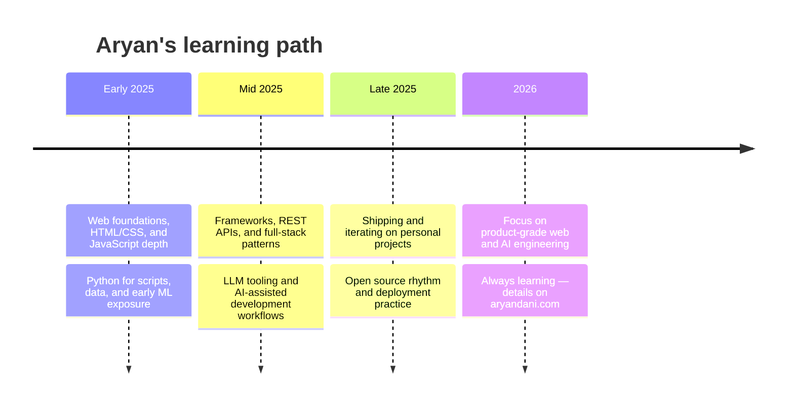

<!-- @format -->

  <picture>
    <source media="(prefers-color-scheme: dark)" srcset="https://raw.githubusercontent.com/aryan-dani/aryan-dani/main/dark.svg">
    <source media="(prefers-color-scheme: light)" srcset="https://raw.githubusercontent.com/aryan-dani/aryan-dani/main/light.svg">
    
  </picture>
    
  
  

 

  
   
  
   
  

---

## My tech journey

```mermaid
timeline
    title Aryan's learning path
    Early 2025
        : Web foundations, HTML/CSS, and JavaScript depth
        : Python for scripts, data, and early ML exposure
    Mid 2025
        : Frameworks, REST APIs, and full-stack patterns
        : LLM tooling and AI-assisted development workflows
    Late 2025
        : Shipping and iterating on personal projects
        : Open source rhythm and deployment practice
    2026
        : Focus on product-grade web and AI engineering
        : Always learning — details on aryandani.com
```

---

## Fun facts

- Addicted to tea, not coffee (don't @ me)
- Could talk about AI, tech, and gadgets for hours
- Love smartphones more than most people love pizza
- Coding with lo-fi and chai = perfect combo

---

## GitHub activity

  
    
  

---

  <picture>
    <source media="(prefers-color-scheme: dark)" srcset="https://raw.githubusercontent.com/aryan-dani/aryan-dani/output/github-snake-dark.svg" />
    <source media="(prefers-color-scheme: light)" srcset="https://raw.githubusercontent.com/aryan-dani/aryan-dani/output/github-snake.svg" />
    
  </picture>
    
  

