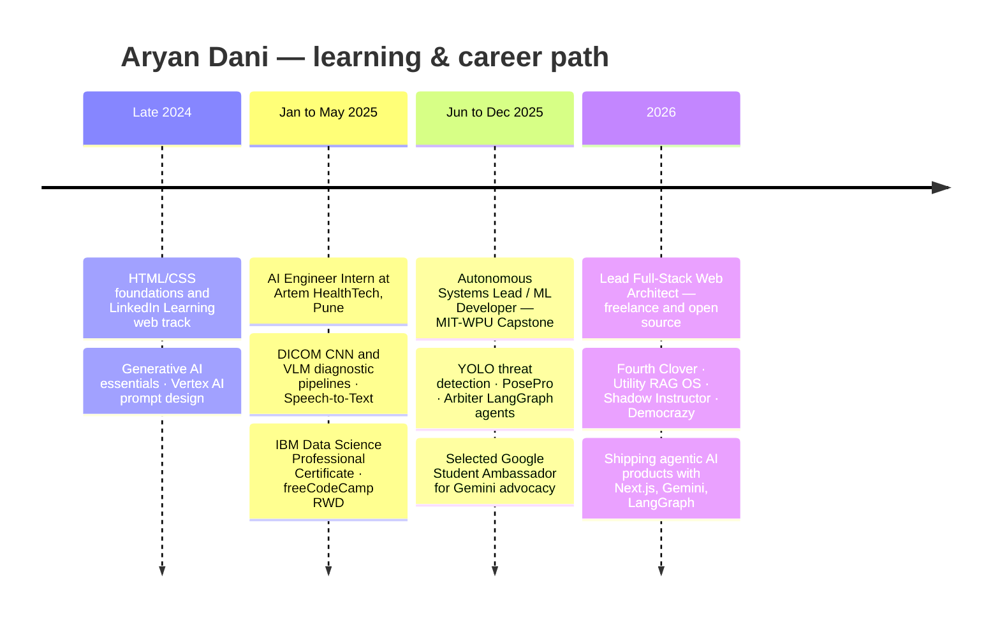

<!-- @format -->

<!--
  Profile card (dark.svg / light.svg) is generated by generate_profile.py
  and refreshed daily via .github/workflows/profile.yml
-->

  <picture>
    <source media="(prefers-color-scheme: dark)" srcset="https://raw.githubusercontent.com/aryan-dani/aryan-dani/main/dark.svg?v=4" />
    <source media="(prefers-color-scheme: light)" srcset="https://raw.githubusercontent.com/aryan-dani/aryan-dani/main/light.svg?v=4" />
    
  </picture>

---

### Featured work

<table>
  <thead>
    <tr>
      <th align="left">
        
         Project
      </th>
      <th align="left">
        
         What it is
      </th>
      <th align="left">
        
         Links
      </th>
    </tr>
  </thead>
  <tbody>
    <tr>
      <td><strong>Shadow Instructor</strong></td>
      <td>Dual-agent technical interview simulator on Gemini 3.0</td>
      <td><a href="https://the-shadow-instructor.vercel.app/">Live</a> · <a href="https://github.com/aryan-dani/The_Shadow_Instructor">Repo</a></td>
    </tr>
    <tr>
      <td><strong>Arbiter</strong></td>
      <td>Autonomous CI/CD healing agents · RIFT 2026</td>
      <td><a href="https://thearbiter.vercel.app/">Live</a> · <a href="https://github.com/aryan-dani/Arbiter">Repo</a></td>
    </tr>
    <tr>
      <td><strong>Utility</strong></td>
      <td>Academic OS with document intelligence / RAG</td>
      <td><a href="https://utilityos.tech">Live</a> · <a href="https://github.com/aryan-dani/Utility">Repo</a></td>
    </tr>
    <tr>
      <td><strong>The Fourth Clover</strong></td>
      <td>Minimal blogging platform · Next.js 15 + Supabase</td>
      <td><a href="https://thefourthclover.bio/">Live</a> · <a href="https://github.com/aryan-dani/The-Fourth-Clover">Repo</a></td>
    </tr>
    <tr>
      <td><strong>Democrazy</strong></td>
      <td>Election-readiness learning app with Gemini</td>
      <td><a href="https://democrazy-omega.vercel.app/">Live</a> · <a href="https://github.com/aryan-dani/Democrazy">Repo</a></td>
    </tr>
    <tr>
      <td><strong>Threat Detection</strong></td>
      <td>YOLO v11 + EfficientNetV2 capstone pipeline</td>
      <td><a href="https://aryan-dani.github.io/Threat_Detection_System/">Live</a> · <a href="https://github.com/aryan-dani/Threat_Detection_System">Repo</a></td>
    </tr>
  </tbody>
</table>

More on [aryandani.com/projects](https://www.aryandani.com/projects).

---

### My Tech Journey

```mermaid
timeline
    title Aryan Dani — learning & career path
    Late 2024
        : HTML/CSS foundations and LinkedIn Learning web track
        : Generative AI essentials · Vertex AI prompt design
    Jan to May 2025
        : AI Engineer Intern at Artem HealthTech, Pune
        : DICOM CNN and VLM diagnostic pipelines · Speech-to-Text
        : IBM Data Science Professional Certificate · freeCodeCamp RWD
    Jun to Dec 2025
        : Autonomous Systems Lead / ML Developer — MIT-WPU Capstone
        : YOLO threat detection · PosePro · Arbiter LangGraph agents
        : Selected Google Student Ambassador for Gemini advocacy
    2026
        : Lead Full-Stack Web Architect — freelance and open source
        : Fourth Clover · Utility RAG OS · Shadow Instructor · Democrazy
        : Shipping agentic AI products with Next.js, Gemini, LangGraph
```

---

### Activity

  
    
  

---

  <picture>
    <source media="(prefers-color-scheme: dark)" srcset="https://raw.githubusercontent.com/aryan-dani/aryan-dani/output/github-snake-dark.svg" />
    <source media="(prefers-color-scheme: light)" srcset="https://raw.githubusercontent.com/aryan-dani/aryan-dani/output/github-snake.svg" />
    
  </picture>

---

  

