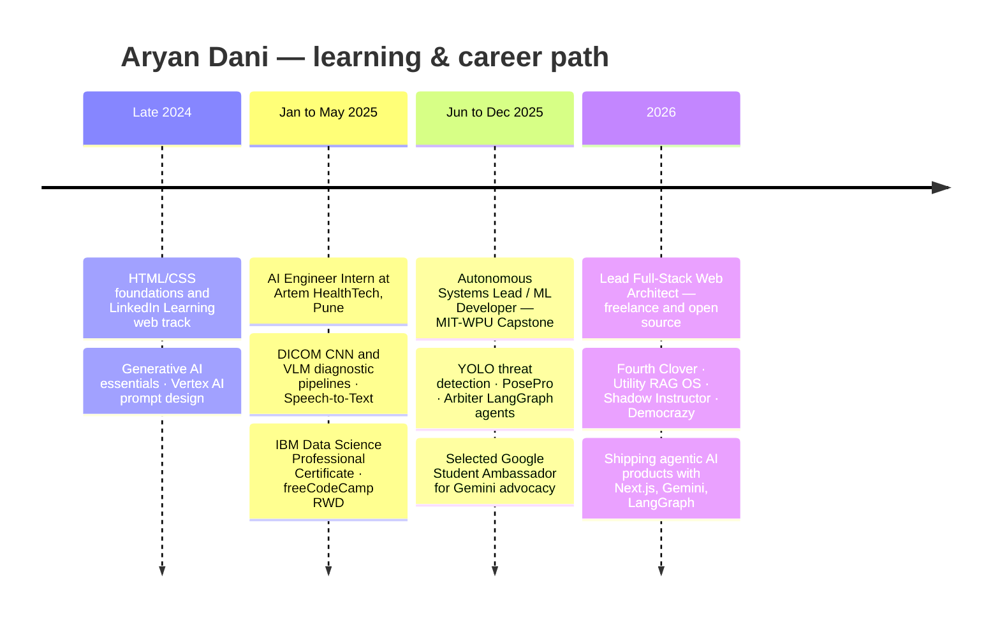

<!-- @format -->

<!--
  Profile card (dark.svg / light.svg) is generated by generate_profile.py
  and refreshed daily via .github/workflows/profile.yml
-->

  <picture>
    <source media="(prefers-color-scheme: dark)" srcset="https://raw.githubusercontent.com/aryan-dani/aryan-dani/main/dark.svg" />
    <source media="(prefers-color-scheme: light)" srcset="https://raw.githubusercontent.com/aryan-dani/aryan-dani/main/light.svg" />
    
  </picture>

    

  

 

  

---

### Featured work

| Project | What it is | Links |
| :-- | :-- | :-- |
| **Shadow Instructor** | Dual-agent technical interview simulator on Gemini 3.0 | [Live](https://the-shadow-instructor.vercel.app/) · [Repo](https://github.com/aryan-dani/The_Shadow_Instructor) |
| **Arbiter** | Autonomous CI/CD healing agents · RIFT 2026 | [Live](https://thearbiter.vercel.app/) · [Repo](https://github.com/aryan-dani/Arbiter) |
| **Utility** | Academic OS with document intelligence / RAG | [Live](https://utilityos.tech) · [Repo](https://github.com/aryan-dani/Utility) |
| **The Fourth Clover** | Minimal blogging platform · Next.js 15 + Supabase | [Live](https://thefourthclover.bio/) · [Repo](https://github.com/aryan-dani/The-Fourth-Clover) |
| **Democrazy** | Election-readiness learning app with Gemini | [Live](https://democrazy-omega.vercel.app/) · [Repo](https://github.com/aryan-dani/Democrazy) |
| **Threat Detection** | YOLO v11 + EfficientNetV2 capstone pipeline | [Live](https://aryan-dani.github.io/Threat_Detection_System/) · [Repo](https://github.com/aryan-dani/Threat_Detection_System) |

More on [aryandani.com/projects](https://www.aryandani.com/projects).

---

### My tech journey

```mermaid
timeline
    title Aryan Dani — learning & career path
    Late 2024
        : HTML/CSS foundations and LinkedIn Learning web track
        : Generative AI essentials · Vertex AI prompt design
    Jan to May 2025
        : AI Engineer Intern at Artem HealthTech, Pune
        : DICOM CNN and VLM diagnostic pipelines · Speech-to-Text
        : IBM Data Science Professional Certificate · freeCodeCamp RWD
    Jun to Dec 2025
        : Autonomous Systems Lead / ML Developer — MIT-WPU Capstone
        : YOLO threat detection · PosePro · Arbiter LangGraph agents
        : Selected Google Student Ambassador for Gemini advocacy
    2026
        : Lead Full-Stack Web Architect — freelance and open source
        : Fourth Clover · Utility RAG OS · Shadow Instructor · Democrazy
        : Shipping agentic AI products with Next.js, Gemini, LangGraph
```

---

### Activity

  
    
  

 

  <picture>
    <source media="(prefers-color-scheme: dark)" srcset="https://raw.githubusercontent.com/aryan-dani/aryan-dani/output/github-snake-dark.svg" />
    <source media="(prefers-color-scheme: light)" srcset="https://raw.githubusercontent.com/aryan-dani/aryan-dani/output/github-snake.svg" />
    
  </picture>

---

  <i>Chai over coffee. Anime when stuck. Always shipping.</i>  
  

