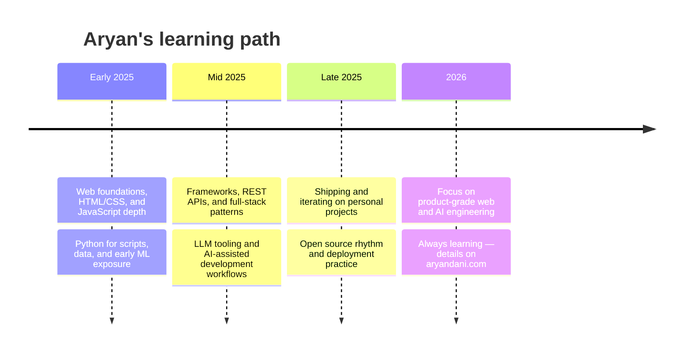

<!-- @format -->

  <picture>
    <source media="(prefers-color-scheme: dark)" srcset="https://raw.githubusercontent.com/aryan-dani/aryan-dani/main/dark.svg">
    <source media="(prefers-color-scheme: light)" srcset="https://raw.githubusercontent.com/aryan-dani/aryan-dani/main/light.svg">
    
  </picture>

   

  

    
    
  

 

  <kbd style="display: block; width: 100%;">
    

      

      

      
    

  </kbd>

---

## My tech journey

```mermaid
timeline
    title Aryan's learning path
    Early 2025
        : Web foundations, HTML/CSS, and JavaScript depth
        : Python for scripts, data, and early ML exposure
    Mid 2025
        : Frameworks, REST APIs, and full-stack patterns
        : LLM tooling and AI-assisted development workflows
    Late 2025
        : Shipping and iterating on personal projects
        : Open source rhythm and deployment practice
    2026
        : Focus on product-grade web and AI engineering
        : Always learning — details on aryandani.com
```

---

## Let's connect

  

    
Open to collaborations and tech chats — reach out here:

  

      
      
      
      
    

  

---

## Fun facts

  

    <table width="90%" align="center">
      <tr>
        <td width="5%" align="right"></td>
        <td width="50%" align="left">Addicted to tea, not coffee (don't @ me 😤).</td>
      </tr>
      <tr><td colspan="2" height="10"></td></tr>
      <tr>
        <td width="5%" align="right"></td>
        <td width="50%" align="left">Could talk about AI, tech, and gadgets for hours.</td>
      </tr>
      <tr><td colspan="2" height="10"></td></tr>
      <tr>
        <td width="5%" align="right"></td>
        <td width="50%" align="left">I love smartphones more than most people love pizza (and that's saying something).</td>
      </tr>
      <tr><td colspan="2" height="10"></td></tr>
      <tr>
        <td width="5%" align="right"></td>
        <td width="50%" align="left">Coding with lo-fi and chai = perfect combo.</td>
      </tr>
    </table>
  

---

## GitHub activity

  

  

  

  
  

---

  <picture>
    <source media="(prefers-color-scheme: dark)" srcset="https://raw.githubusercontent.com/aryan-dani/aryan-dani/output/github-snake-dark.svg" />
    <source media="(prefers-color-scheme: light)" srcset="https://raw.githubusercontent.com/aryan-dani/aryan-dani/output/github-snake.svg" />
    
  </picture>

  

    
  

