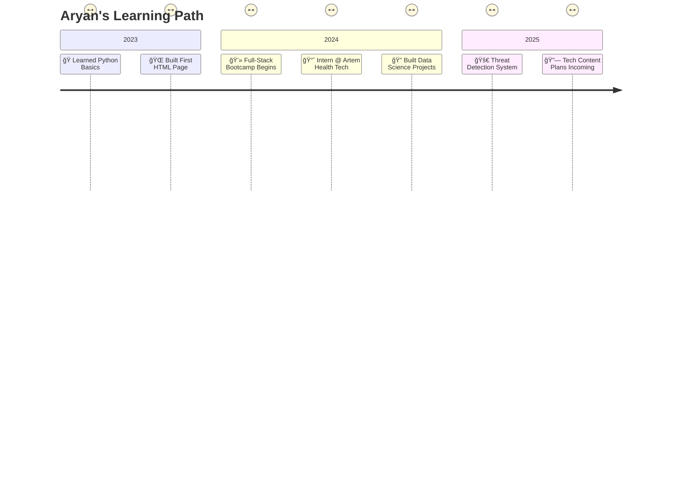

<!-- ... existing animated title ... -->

<!-- Subtitle - Left aligned -->
<h3 style="font-weight: 500; margin-top:0; font-family: 'Poppins', sans-serif; text-align: center;"> <!-- Kept subtitle centered as it looks better below the main title -->

</h3>

<!-- Profile views - Centered -->

<!-- Divider -->

  
<!-- GitHub trophies - Centered -->

<!-- Added border style for outline -->

<!-- Divider -->

---

<!-- Section Wrapper: Tech Stack -->

  <h2 align="left" style="font-weight: 700; margin-bottom: 25px; color: #c9d1d9; font-family: 'Poppins', sans-serif;">
    
    Tech Stack Breakdown
  </h2>

  <!-- Languages -->
  

    <h3 style="font-weight: 600; color: #c9d1d9; margin-top: 0; font-family: 'Poppins', sans-serif; display: flex; align-items: center;">
       
      💻 Languages
    </h3>
    <ul style="color: #8b949e; margin-bottom: 0;">
      <li><b style="color: #c9d1d9;">C/C++</b>: For systems programming and performance-critical applications.</li>
      <li><b style="color: #c9d1d9;">Python</b>: Data science, AI/ML, scripting, and automation.</li>
      <li><b style="color: #c9d1d9;">JavaScript/TypeScript</b>: Building interactive, scalable web applications.</li>
    </ul>
  

  <!-- Frontend -->
  

    <h3 style="font-weight: 600; color: #c9d1d9; margin-top: 0; font-family: 'Poppins', sans-serif; display: flex; align-items: center;">
       
      🌐 Frontend
    </h3>
    <ul style="color: #8b949e; margin-bottom: 0;">
      <li><b style="color: #c9d1d9;">HTML5, CSS3, SASS</b>: Crafting responsive, visually appealing interfaces.</li>
      <li><b style="color: #c9d1d9;">Bootstrap</b>: Rapid prototyping and responsive design.</li>
      <li><b style="color: #c9d1d9;">Angular & React</b>: Dynamic single-page applications (SPAs) with modern frameworks.</li>
    </ul>
  

  <!-- AI/ML -->
  

    <h3 style="font-weight: 600; color: #c9d1d9; margin-top: 0; font-family: 'Poppins', sans-serif; display: flex; align-items: center;">
       
      🧠 AI / ML
    </h3>
    <ul style="color: #8b949e; margin-bottom: 0;">
      <li><b style="color: #c9d1d9;">TensorFlow (with Keras)</b>: Deep learning for image and text processing.</li>
      <li><b style="color: #c9d1d9;">PyTorch</b>: Experimenting with neural networks and real-time AI solutions.</li>
      <li><b style="color: #c9d1d9;">OpenCV</b>: Computer vision for real-time object detection.</li>
    </ul>
  

  <!-- Tools -->
  

    <h3 style="font-weight: 600; color: #c9d1d9; margin-top: 0; font-family: 'Poppins', sans-serif; display: flex; align-items: center;">
       
      ⚙️ Tools & Platforms
    </h3>
    <ul style="color: #8b949e; margin-bottom: 0;">
      <li><b style="color: #c9d1d9;">VS Code</b>: Primary editor with productivity-boosting extensions.</li>
      <li><b style="color: #c9d1d9;">Git & GitHub</b>: Version control and collaborative development.</li>
      <li><b style="color: #c9d1d9;">Google Cloud Platform (GCP)</b>: Cloud services for AI and data processing.</li>
      <li><b style="color: #c9d1d9;">AWS</b>: Scalable cloud infrastructure for applications.</li>
    </ul>
  

  
  <!-- SHIELDS.IO TECH STACK WITH MONOCHROME THEME -->
  

    <h3 align="left" style="font-weight: 600; margin-bottom: 20px; color: #c9d1d9; font-family: 'Poppins', sans-serif;">
      🛠️ My Tech Stack
    </h3>
    

      <!-- Programming Languages -->
      
      
      
      
    

    

      <!-- Frontend -->
      
      
      
      
      
    

    

      <!-- AI/ML -->
      
      
      
      
      
    

    

      <!-- Tools -->
      
      
      
      
    

    

      <!-- Database -->
      
      
      
    

  

---

<!-- Section Wrapper: Featured Projects -->

## 🚀 Featured Projects

| Project                                                                        | Tech                                   | Description                                                                                                                      |
| ------------------------------------------------------------------------------ | -------------------------------------- | -------------------------------------------------------------------------------------------------------------------------------- |
| 🔫 [**Threat Detection**](https://github.com/aryan-dani/threat-detection-yolo) | Python, Deep Learning, OpenCV, YOLOv11 | Real-time object detection system identifying threats via CCTV footage. Achieved 85% accuracy in spotting suspicious activities. |
| 💼 [**Portfolio Website**](https://aryan-dani.github.io/Portfolio)             | HTML, CSS, JS,                         | A responsive, interactive site showcasing my projects and skills. Features smooth animations and a modern design.                |
| 📊 [**Expense Tracker**](https://github.com/aryan-dani/expense-tracker)        | Google Forms, Make.com, Google Sheets  | Automated expense tracking integrating Google Forms for input and Sheets for real-time visualization and analysis.               |

<!-- Section Wrapper: Certifications & Learning -->

## 🧪 Certifications

- 📜 **[IBM Data Science Professional Certificate](https://example.com)**  
  Mastered data analysis, visualization, and machine learning with Python.

- 🧠 **[Full-Stack Web Dev by Colt Steele](https://example.com)**  
  Built MERN stack applications from scratch.

- 🛠️ **[Angular Course by Maximilian Schwarzmüller](https://example.com)**  
  Developed scalable SPAs with Angular.

- 📊 **[Data Visualization, Python for Everybody](https://example.com)**  
  Enhanced skills in data storytelling and Python programming.

---

<!-- Section Wrapper: My Tech Journey -->

<h2 align="left" style="font-weight: 600; margin-bottom: 25px; font-family: 'Poppins', sans-serif;"> <!-- Changed align to left -->
📅 My Tech Journey
</h2>

<!-- Timeline -->
<table style="width: 100%; color: #c9d1d9; font-family: 'Poppins', sans-serif;">
<tr>
  <td width="15%" align="right" style="vertical-align: top; padding-right: 10px; font-family: 'Poppins', sans-serif;"><b>2023 🌱</b></td>
  <td width="85%" style="border-left: 2px solid #30363d; padding-left: 15px;">
    <ul style="margin: 0; padding-left: 20px; color: #8b949e; font-family: 'Poppins', sans-serif; text-align: left;"> <!-- Added text-align: left -->
      <li style="font-family: 'Poppins', sans-serif;">Learned Python basics and fundamentals of programming</li>
      <li style="font-family: 'Poppins', sans-serif;">Built my first HTML page and ventured into web development</li>
      <li style="font-family: 'Poppins', sans-serif;">Experimented with small coding projects to build a foundation</li>
    </ul>
  </td>
</tr>
  <tr><td colspan="2" style="height: 15px;"></td></tr> <!-- Spacer -->
<tr>
  <td width="15%" align="right" style="vertical-align: top; padding-right: 10px; font-family: 'Poppins', sans-serif;"><b>2024 🌿</b></td>
  <td width="85%" style="border-left: 2px solid #30363d; padding-left: 15px;">
    <ul style="margin: 0; padding-left: 20px; color: #8b949e; font-family: 'Poppins', sans-serif; text-align: left;"> <!-- Added text-align: left -->
      <li style="font-family: 'Poppins', sans-serif;">Completed an intensive Full-Stack Development Bootcamp</li>
      <li style="font-family: 'Poppins', sans-serif;">Secured internship at Artem Health Tech, gaining real-world industry experience</li>
      <li style="font-family: 'Poppins', sans-serif;">Developed multiple data science projects using Python and ML frameworks</li>
    </ul>
  </td>
</tr>
  <tr><td colspan="2" style="height: 15px;"></td></tr> <!-- Spacer -->
<tr>
  <td width="15%" align="right" style="vertical-align: top; padding-right: 10px; font-family: 'Poppins', sans-serif;"><b>2025 🌳</b></td>
  <td width="85%" style="border-left: 2px solid #30363d; padding-left: 15px;">
    <ul style="margin: 0; padding-left: 20px; color: #8b949e; font-family: 'Poppins', sans-serif; text-align: left;"> <!-- Added text-align: left -->
      <li style="font-family: 'Poppins', sans-serif;">Building advanced Threat Detection System using YOLOv11 and CNN architectures</li>
      <li style="font-family: 'Poppins', sans-serif;">Planning to launch tech content creation channels focused on AI & web development</li>
      <li style="font-family: 'Poppins', sans-serif;">Exploring opportunities to contribute to open-source AI communities</li>
    </ul>
  </td>
</tr>
</table>

<!-- Skill Progress Bars (Dark Theme Adjusted) -->

  <h4 align="left" style="font-weight: 600; color: #c9d1d9; margin-bottom: 15px; font-family: 'Poppins', sans-serif;">Skill Growth Over Time</h4> <!-- Changed align to left -->
<table style="width:100%; font-family: 'Poppins', sans-serif;">
  <tr>
    <td width="15%" align="right" style="padding-right: 10px; font-family: 'Poppins', sans-serif;"><b>2023</b></td>
    <td width="85%">
      

        

      

      
Est. Skills: 35%
 <!-- Changed align to left -->
    </td>
  </tr>
  <tr>
    <td width="15%" align="right" style="padding-right: 10px; font-family: 'Poppins', sans-serif;"><b>2024</b></td>
    <td width="85%">
      

        

      

      
Est. Skills: 65%
 <!-- Changed align to left -->
    </td>
  </tr>
  <tr>
    <td width="15%" align="right" style="padding-right: 10px; font-family: 'Poppins', sans-serif;"><b>2025</b></td>
    <td width="85%">
      

        

      

      
Est. Skills: 85%
 <!-- Changed align to left -->
    </td>
  </tr>
</table>

<!-- Section Wrapper: Let's Connect -->

<h2 align="left" style="font-weight: 600; margin-bottom: 15px; font-family: 'Poppins', sans-serif;"> <!-- Changed align to left -->
📫 Let's Connect
</h2>

I'm always looking to collaborate on exciting projects or just chat about tech! Reach out through any of these platforms:
 <!-- Changed align to left -->

 <!-- Kept badges centered -->

<!-- Section Wrapper: Fun Facts -->

<h2 align="left" style="font-weight: 600; margin-bottom: 15px; font-family: 'Poppins', sans-serif;"> <!-- Changed align to left -->
✨ Fun Facts About Me
</h2>
<ul style="list-style-type: none; padding-left: 0; color: #8b949e; font-family: 'Poppins', sans-serif; text-align: left;"> <!-- Added text-align: left -->
<li style="margin-bottom: 8px; font-family: 'Poppins', sans-serif;">🧋 Addicted to tea, not coffee (don't @ me 😤).</li>
<li style="margin-bottom: 8px; font-family: 'Poppins', sans-serif;">🤖 Could talk about AI, tech, and gadgets for hours.</li>
<li style="margin-bottom: 8px; font-family: 'Poppins', sans-serif;">📱 I love smartphones more than most people love pizza (and that's saying something).</li>
<li style="font-family: 'Poppins', sans-serif;">💻 Coding with lo-fi and chai = perfect combo.</li>
</ul>

<!-- Section Wrapper: GitHub Stats -->

<h2 align="center" style="font-weight: 600; margin-bottom: 25px; color: #c9d1d9; font-family: 'Poppins', sans-serif;">
📊 GitHub Stats
</h2>

<!-- GitHub Streak Stats -->

  
  

<!-- Snake Animation -->

 <!-- Kept centered -->
<picture>
<source media="(prefers-color-scheme: dark)" srcset="https://raw.githubusercontent.com/aryan-dani/aryan-dani/output/github-snake-dark.svg" />
<source media="(prefers-color-scheme: light)" srcset="https://raw.githubusercontent.com/aryan-dani/aryan-dani/output/github-snake.svg" />

</picture>

<!-- Status indicator - Centered -->

