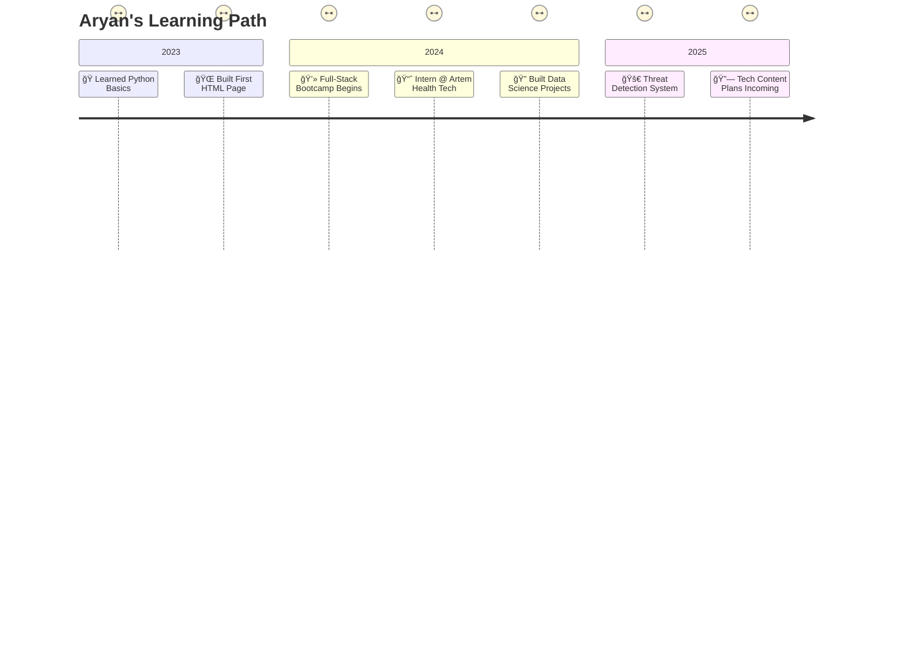

<!-- @format -->

<kbd style="display: block; width: 100%;">

  

  

  
</kbd>
  
<kbd style="display: block; width: 100%;">
  
</kbd>
  
   
<kbd>
  <!-- GitHub trophies -->
  

  

</kbd>

## 🛠️ Tech Stack Breakdown

<h3>💻 Languages</h3>

  
  
  
  

<h3>🌐 Web Development</h3>

  
  
  
  
  

<h3>🧠 AI / ML</h3>

  
  
  
  
  

<h3>⚙️ Tools & Platforms</h3>

  
  
  
  

<h3>🗄️ Databases</h3>

  
  
  

---

## 🚀 Featured Projects

<table width="90%">
<thead>
  <tr>
    <th width="180px" align="center">Project</th>
    <th width="200px" align="center">Tech</th>
    <th width="350px" align="center">Description</th>
  </tr>
</thead>
<tbody>
  <tr>
    <td>🔫 <a href="https://github.com/aryan-dani/threat-detection-yolo"><b>Threat Detection</b></a></td>
    <td>Python, Deep Learning, OpenCV, YOLOv11</td>
    <td>Real-time object detection system identifying threats via CCTV footage. Achieved 85% accuracy in spotting suspicious activities.</td>
  </tr>
  <tr>
    <td>💼 <a href="https://aryan-dani.github.io/Portfolio"><b>Portfolio Website</b></a></td>
    <td>HTML, CSS, JS</td>
    <td>A responsive, interactive site showcasing my projects and skills. Features smooth animations and a modern design.</td>
  </tr>
  <tr>
    <td>📊 <a href="https://github.com/aryan-dani/expense-tracker"><b>Expense Tracker</b></a></td>
    <td>Google Forms, Make.com, Google Sheets</td>
    <td>Automated expense tracking integrating Google Forms for input and Sheets for real-time visualization and analysis.</td>
  </tr>
</tbody>
</table>

---

## 🧪 Certifications

  <table width="90%" align="center" style="border: none;">
    <tr>
      <td width="48%" align="right" valign="middle">📜 <b>IBM Data Science Professional Certificate</b></td>
      <td width="52%" align="left" valign="middle">Mastered data analysis, visualization, and machine learning with Python.</td>
    </tr>
    <tr><td colspan="2" height="15"></td></tr>
    <tr>
      <td width="48%" align="right" valign="middle">🧠 <b>Full-Stack Web Dev by Colt Steele</b></td>
      <td width="52%" align="left" valign="middle">Built MERN stack applications from scratch.</td>
    </tr>
    <tr><td colspan="2" height="15"></td></tr>
    <tr>
      <td width="48%" align="right" valign="middle">🛠️ <b>Angular Course by Maximilian Schwarzmüller</b></td>
      <td width="52%" align="left" valign="middle">Developed scalable SPAs with Angular.</td>
    </tr>
    <tr><td colspan="2" height="15"></td></tr>
    <tr>
      <td width="48%" align="right" valign="middle">📊 <b>Data Visualization, Python for Everybody</b></td>
      <td width="52%" align="left" valign="middle">Enhanced skills in data storytelling and Python programming.</td>
    </tr>
  </table>

---

## 📅 My Tech Journey

<table width="100%" align = center>
<tr><td>

  <h3>Timeline</h3>

  <table width="90%" align="center">
    <tr>
      <td align="right" width="120px"><b>2023 🌱</b></td>
      <td>
        • Learned Python basics and fundamentals of programming 
        • Built my first HTML page and ventured into web development 
        • Experimented with small coding projects to build a foundation
      </td>
    </tr>
    <tr><td colspan="2" height="10"></td></tr>
    <tr>
      <td align="right" width="120px"><b>2024 🌿</b></td>
      <td>
        • Completed an intensive Full-Stack Development Bootcamp 
        • Secured internship at Artem Health Tech, gaining real-world industry experience 
        • Developed multiple data science projects using Python and ML frameworks
      </td>
    </tr>
    <tr><td colspan="2" height="10"></td></tr>
    <tr>
      <td align="right" width="120px"><b>2025 🌳</b></td>
      <td>
        • Building advanced Threat Detection System using YOLOv11 and CNN architectures 
        • Planning to launch tech content creation channels focused on AI & web development 
        • Exploring opportunities to contribute to open-source AI communities
      </td>
    </tr>
  </table>

  <h3>Skill Growth Over Time</h3>
  
  <table width="90%" align="center">
    <tr>
      <td align="right" width="60px"><b>2023</b></td>
      <td>
        
        <i>Est. Skills: 35%</i>
      </td>
    </tr>
    <tr><td colspan="2" height="10"></td></tr>
    <tr>
      <td align="right" width="60px"><b>2024</b></td>
      <td>
        
        <i>Est. Skills: 65%</i>
      </td>
    </tr>
    <tr><td colspan="2" height="10"></td></tr>
    <tr>
      <td align="right" width="60px"><b>2025</b></td>
      <td>
        
        <i>Est. Skills: 85%</i>
      </td>
    </tr>
  </table>

</td></tr>
</table>

---

## 📫 Let's Connect

<table width="100%" align = center>
<tr><td>

I'm always looking to collaborate on exciting projects or just chat about tech! Reach out through any of these platforms:

  
  
  
  

</td></tr>
</table>

---

## ✨ Fun Facts About Me

  <table width="90%" align="center"> <!-- Adjusted width to 90% for consistency -->
    <tr>
      <td width="5%" align="right">🧋</td>
      <td width="50%" align="left">Addicted to tea, not coffee (don't @ me 😤).</td>
    </tr>
    <tr>
      <td width="5%" align="right">🤖</td>
      <td width="50%" align="left">Could talk about AI, tech, and gadgets for hours.</td>
    </tr>
    <tr>
      <td width="5%" align="right">📱</td>
      <td width="50%" align="left">I love smartphones more than most people love pizza (and that's saying something).</td>
    </tr>
    <tr>
      <td width="5%" align="right">💻</td>
      <td width="50%" align="left">Coding with lo-fi and chai = perfect combo.</td>
    </tr>
  </table>

---

## 📊 GitHub Stats

<table width="100%">
<tr><td>

  <!-- GitHub Streak Stats - Monochrome -->
  

  

  <!-- Smaller width stats cards with flex layout -->
  
  &nbsp;&nbsp;
  

  

  <!-- Activity Graph -->
  

</td></tr>
</table>

---

  <!-- Snake Animation - Monochrome style -->
  <picture>
    <source media="(prefers-color-scheme: dark)" srcset="https://raw.githubusercontent.com/aryan-dani/aryan-dani/output/github-snake-dark.svg" />
    <source media="(prefers-color-scheme: light)" srcset="https://raw.githubusercontent.com/aryan-dani/aryan-dani/output/github-snake.svg" />
    
  </picture>

  

    
  

