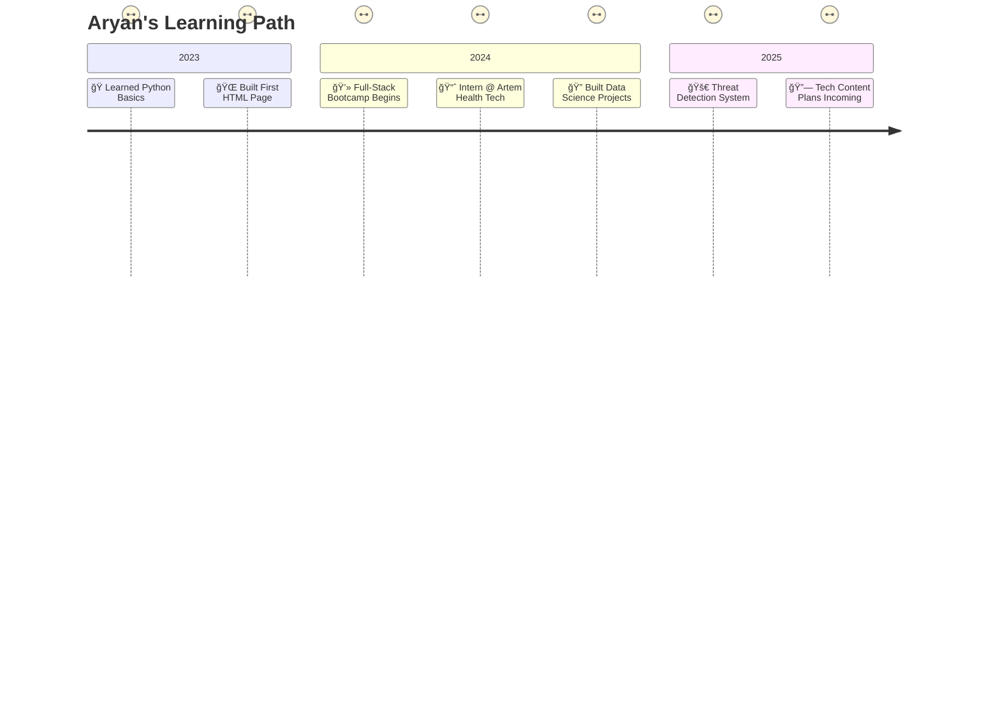

  

  

  

  

  
   

  <!-- GitHub trophies -->
  

  

 

## 🛠️ Tech Stack Breakdown
<kbd>

  <h3>💻 Languages</h3>
  

    <b>C/C++</b>: For systems programming and performance-critical applications 
    <b>Python</b>: Data science, AI/ML, scripting, and automation 
    <b>JavaScript/TypeScript</b>: Building interactive, scalable web applications
  

  
  <h3>🌐 Frontend</h3>
  

    <b>HTML5, CSS3, SASS</b>: Crafting responsive, visually appealing interfaces 
    <b>Bootstrap</b>: Rapid prototyping and responsive design 
    <b>Angular & React</b>: Dynamic single-page applications (SPAs) with modern frameworks
  

  
  <h3>🧠 AI / ML</h3>
  

    <b>TensorFlow (with Keras)</b>: Deep learning for image and text processing 
    <b>PyTorch</b>: Experimenting with neural networks and real-time AI solutions 
    <b>OpenCV</b>: Computer vision for real-time object detection
  

  
  <h3>⚙️ Tools & Platforms</h3>
  

    <b>VS Code</b>: Primary editor with productivity-boosting extensions 
    <b>Git & GitHub</b>: Version control and collaborative development 
    <b>Google Cloud Platform (GCP)</b>: Cloud services for AI and data processing 
    <b>AWS</b>: Scalable cloud infrastructure for applications
  

</kbd>

  <h3>🛠️ My Tech Stack</h3>

  <!-- Programming Languages -->
  

    
    
    
    
  

  <!-- Frontend -->
  

    
    
    
    
    
  

  <!-- AI/ML -->
  

    
    
    
    
    
  

  <!-- Tools -->
  

    
    
    
    
  

  <!-- Database -->
  

    
    
    
  

 

## 🚀 Featured Projects

| Project                                                                        | Tech                                   | Description                                                                                                                      |
| :----------------------------------------------------------------------------- | :------------------------------------- | :------------------------------------------------------------------------------------------------------------------------------- |
| 🔫 [**Threat Detection**](https://github.com/aryan-dani/threat-detection-yolo) | Python, Deep Learning, OpenCV, YOLOv11 | Real-time object detection system identifying threats via CCTV footage. Achieved 85% accuracy in spotting suspicious activities. |
| 💼 [**Portfolio Website**](https://aryan-dani.github.io/Portfolio)             | HTML, CSS, JS                          | A responsive, interactive site showcasing my projects and skills. Features smooth animations and a modern design.                |
| 📊 [**Expense Tracker**](https://github.com/aryan-dani/expense-tracker)        | Google Forms, Make.com, Google Sheets  | Automated expense tracking integrating Google Forms for input and Sheets for real-time visualization and analysis.               |

 

## 🧪 Certifications

- 📜 **[IBM Data Science Professional Certificate](https://example.com)**  
  Mastered data analysis, visualization, and machine learning with Python.

- 🧠 **[Full-Stack Web Dev by Colt Steele](https://example.com)**  
  Built MERN stack applications from scratch.

- 🛠️ **[Angular Course by Maximilian Schwarzmüller](https://example.com)**  
  Developed scalable SPAs with Angular.

- 📊 **[Data Visualization, Python for Everybody](https://example.com)**  
  Enhanced skills in data storytelling and Python programming.

 

<kbd>
<h2 align="center">📅 My Tech Journey</h2>

  <h3>Timeline</h3>

  <table>
    <tr>
      <td align="right" width="120px"><b>2023 🌱</b></td>
      <td>
        • Learned Python basics and fundamentals of programming 
        • Built my first HTML page and ventured into web development 
        • Experimented with small coding projects to build a foundation
      </td>
    </tr>
    <tr><td colspan="2" height="10"></td></tr>
    <tr>
      <td align="right" width="120px"><b>2024 🌿</b></td>
      <td>
        • Completed an intensive Full-Stack Development Bootcamp 
        • Secured internship at Artem Health Tech, gaining real-world industry experience 
        • Developed multiple data science projects using Python and ML frameworks
      </td>
    </tr>
    <tr><td colspan="2" height="10"></td></tr>
    <tr>
      <td align="right" width="120px"><b>2025 🌳</b></td>
      <td>
        • Building advanced Threat Detection System using YOLOv11 and CNN architectures 
        • Planning to launch tech content creation channels focused on AI & web development 
        • Exploring opportunities to contribute to open-source AI communities
      </td>
    </tr>
  </table>

  <h3>Skill Growth Over Time</h3>
  
  <table width="80%" align="center">
    <tr>
      <td align="right" width="60px"><b>2023</b></td>
      <td>
        
        <i>Est. Skills: 35%</i>
      </td>
    </tr>
    <tr>
      <td align="right" width="60px"><b>2024</b></td>
      <td>
        
        <i>Est. Skills: 65%</i>
      </td>
    </tr>
    <tr>
      <td align="right" width="60px"><b>2025</b></td>
      <td>
        
        <i>Est. Skills: 85%</i>
      </td>
    </tr>
  </table>

</kbd>

 

<kbd>
<h2 align="left">📫 Let's Connect</h2>

I'm always looking to collaborate on exciting projects or just chat about tech! Reach out through any of these platforms:

  
  
  
  

</kbd>

 

<kbd>
<h2 align="left">✨ Fun Facts About Me</h2>

- 🧋 Addicted to tea, not coffee (don't @ me 😤).
- 🤖 Could talk about AI, tech, and gadgets for hours.
- 📱 I love smartphones more than most people love pizza (and that's saying something).
- 💻 Coding with lo-fi and chai = perfect combo.
  </kbd>

 

## 📊 GitHub Stats

  <!-- GitHub Streak Stats - Monochrome -->
  

  

  <!-- Smaller width stats cards with flex layout -->
  
  &nbsp;&nbsp;
  

  

  <!-- Activity Graph -->
  

<!-- Snake Animation - Monochrome style -->

  <picture>
    <source media="(prefers-color-scheme: dark)" srcset="https://raw.githubusercontent.com/aryan-dani/aryan-dani/output/github-snake-dark.svg" />
    <source media="(prefers-color-scheme: light)" srcset="https://raw.githubusercontent.com/aryan-dani/aryan-dani/output/github-snake.svg" />
    
  </picture>

  

